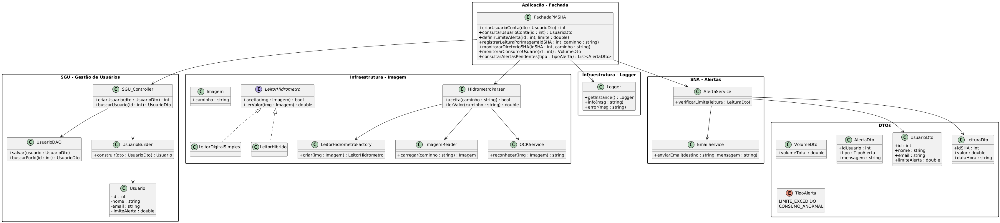

<h1 align="center"> Painel de Monitoramento do SHA </h1>
<p align="center"> 

</p>
<h4 align="center"> Criação de um Painel de Monitoramento de Simulador de Hidrômetro Analógico para a disciplina de Padrões de Projetos. </h4>
<h4 align="center"> Engenharia de Computação/<a href="https://www.ifpb.edu.br/">IFPB</a> (Setembro 2025) </h4>

<br>
</br>
<p align="center"> 
<a href="https://image.jimcdn.com/app/cms/image/transf/dimension=970x10000:format=gif/path/sa16dc2497d80e05e/image/icd162bb94ffa0064/version/1551588419/image.gif" target="_blank"></a>
</p>

<div align="center">
<h4> | <a href="#contexto">Contexto e objetivo</a> | <a href="#estrutura">Estrutura de pastas</a> | <a href="#requisitos">Requisitos</a> | <a href="#uml">Diagrama de classes (UML)</a> | <a href="#padroes">Padrões de Projeto</a> | <a href="#ferramentas">Ferramentas</a> | <a href="#implementacao">Implementação</a> | <a href="#progresso">Progresso</a> | <a href="#creditos">Créditos</a> |</h4>
</div>

<a href="https://imgbox.com/3tZuCnVg" target="_blank"></a>

<h2 id="contexto"> :brain: CONTEXTO E OBJETIVO</h2>

<p>O Painel de Monitoramento do SHA (PMSHA) é um sistema desenvolvido em C++ cujo objetivo é monitorar hidrômetros (SHA) a partir de imagens geradas por projetos externos. Cada hidrômetro funciona de forma independente e gera imagens periódicas representando sua leitura de consumo. O desenvolvimento do projeto dar-se-á uma proposta de atividade para a cadeira de Padrões de Projetos, ministrada pelo professor doutor Katyusco Santos.</p>

<a href="https://imgbox.com/3tZuCnVg" target="_blank"></a>

<h2 id="estrutura"> 📁 ESTRUTURA DE PASTAS DO PROJETO </h2>

```
painel_monitoramento_sha_pp/
│
├── include/
│   ├── fachada/
│   ├── dto/
│   ├── infra/
│   │   ├── imagem/
│   │   └── logger/
│   ├── sgu/
│
├── src/
│   ├── fachada/
│   ├── infra/
│   │   ├── imagem/
│   │   └── logger/
│   ├── sgu/
│   
├── main.cpp
├── imagens
└── README.md
```

<a href="https://imgbox.com/3tZuCnVg" target="_blank"></a>

<h2 id="requisitos"> :clipboard: REQUISITOS FUNCIONAIS E NÃO FUNCIONAIS </h2>

<h4>➔ Requisitos de Funcionalidade</h4>
<ul>
  » Gerenciamento de Usuários e Contas (CRUD):
  <li> RF-FPMH-001: Criar Usuário/Conta; </li>
  <li> RF-FPMH-002: Consultar Usuário/Conta; </li>
  <li> RF-FPMH-003: Atualizar Usuário/Conta; </li>
  <li> RF-FPMH-008: Definir Limite de Alerta. </li>
</ul>

<ul>
  » Monitoramento de Consumo:
  <li> RF-FPMH-005: Monitorar Consumo por SHA; </li>
  <li> RF-FPMH-006: Monitorar Consumo por Usuário (Agregado); </li>
  <li> RF-FPMH-010: Processar Nova Leitura (Imagem). </li>
</ul>

<ul>
  »  Sistema de Alerta:
  <li> RF-FPMH-009: Consultar Alertas Pendentes; </li>
  <li> RF-FPMH-011: Notificar Sistemas Externos. </li>
</ul>

<h4>➔ Requisitos Não Funcionais</h4>
<ul>
  <li> RNF-001: Performance; </li>
  <li> RNF-002: Segurança; </li>
  <li> RNF-003: Disponibilidade; </li>
  <li> RNF-004: Escalabilidade. </li>
</ul>

<a href="https://imgbox.com/3tZuCnVg" target="_blank"></a>

<h2 id="uml"> &#127959 Diagrama de Classes (UML)</h2>

<p>A arquitetura do projeto foi modelada usando um diagrama de classes da Linguagem de Modelagem Unificada (UML). Esta representação visual ilustra a estrutura do sistema, mostrando como as classes se relacionam e interagem para simular o hidrômetro.</p>

<p>O diagrama destaca o relacionamento de Composição, onde a classe Controladora atua como a orquestradora central, possuindo e gerenciando instâncias das classes Entrada, Hidrometro e Display para executar a simulação de ponta a ponta. </p>

<ul>
  <li> <b>Entrada:</b> responsável por ler os parâmetros de configuração de um arquivo de texto (parametros.txt). Ela gerencia a vazão e a pressão, podendo fornecer valores fixos ou aleatórios e, assim, modela a dinâmica de fornecimento de água do sistema; </li>
  <li> <b>Hidrômetro:</b> é a classe principal de medição. Ela mantém o registro do volume de água total e calcular o incremento de volume a cada ciclo de simulação; </li>
  <li> <b>Display:</b> responsável pela parte visual. Ela formata e exibe os dados de medição em uma imagem com cores e formatação específicas, simulando o mostrador de um hidrômetro real; </li>
  <li> <b>Controladora:</b> é o "maestro" do sistema. É a Controladora que cria e gerencia as instâncias de Entrada, Hidrometro e Display. Ela executa o loop principal da simulação, obtendo dados e atualizando o estado do hidrômetro a cada segundo. </li>
</ul>

<ul>
  <h4>➔ UML do projeto: </h4> 
  </ul> 

<p align="center"> 

</p>

<a href="https://imgbox.com/3tZuCnVg" target="_blank"></a>

<h2 id="padroes"> 🧱 Padrões de Projeto</h2>

| Padrão                   | Onde é utilizado       | Objetivo                         |
| ------------------------ | ---------------------- | -------------------------------- |
| **Facade**               | FachadaPMSHA           | Ponto único de acesso ao sistema |
| **Strategy**             | Leitores de hidrômetro | Suporte a múltiplos modelos      |
| **Factory**              | Seleção de leitores    | Escolha dinâmica do parser       |
| **Dependency Inversion** | Fachada                | Desacoplamento de OCR            |
| **Singleton**            | Logger                 | Rastreabilidade global           |
| **DAO**                  | SGU                    | Persistência desacoplada         |
| **Builder**              | SGU                    | Criação de usuários              |
| **Adapter**              | Envio de e-mail        | Isolar bibliotecas externas      |


<a href="https://imgbox.com/3tZuCnVg" target="_blank"></a>

<h2 id="ferramentas"> &#128295 PRINCIPAIS FERRAMENTAS UTILIZADAS </h2>

<ul>
    <li>Linguagem de Programação: C++  </li>
    <li>Editor de Código: Visual Studio Code (VS Code) </li>
    <li>Controle de Versão: Git </li>
    <li>Hospedagem de Código: GitHub </li>
    <li>Diagramação: PlantUML (para a geração do diagrama de classes) </li>
</ul> 

<a href="https://imgbox.com/3tZuCnVg" target="_blank"></a>

<h2 id="implementacao"> &#128187 IMPLEMENTAÇÃO </h2>

<p> A implementação do Painel de Monitoramento SHA segue uma arquitetura orientada a objetos, com forte foco em desacoplamento, extensibilidade e evolução incremental. </p> <ul> <li> A classe <b>FachadaPMSHA</b> atua como ponto único de entrada do sistema, encapsulando toda a complexidade interna e expondo apenas operações de alto nível; </li>

<li>
    O monitoramento de imagens é realizado por diretórios, onde cada pasta representa um SHA ativo. O sistema detecta automaticamente novas imagens e inicia o fluxo de leitura;
</li>

<li>
    A leitura do hidrômetro é feita através do <b>HidrometroParser</b>, que utiliza o padrão Strategy para selecionar dinamicamente o leitor adequado ao modelo do hidrômetro;
</li>

<li>
    O reconhecimento óptico de caracteres (OCR) é atualmente implementado como <b>stub</b>, permitindo validar o fluxo completo do sistema antes da integração com bibliotecas reais;
</li>

<li>
    O módulo <b>SGU</b> (Sistema de Gestão de Usuários) utiliza DAO e Builder para isolar regras de persistência e construção de objetos;
</li>

<li>
    O sistema de alertas é desacoplado da leitura, permitindo futura integração com envio de e-mails, notificações ou dashboards;
</li>

<li>
    Um sistema de <b>Logger</b> centralizado registra todas as ações relevantes, garantindo rastreabilidade e auditabilidade.
</li>
</ul>

<a href="https://imgbox.com/3tZuCnVg" target="_blank"></a>

<h2 id="progresso"> 📊 PROGRESSO DO PROJETO </h2>


<h4>Progresso por Partes </h4>
<ul>

| Módulo                               | Status |
|-------------------------------------|--------|
| Arquitetura e organização           | ██████████ 100% |
| Fachada PMSHA (Facade Pattern)      | ██████████ 100% |
| Monitoramento de SHAs (Diretórios)  | ██████████ 100% |
| Leitura por Imagem (OCR Stub)       | ██████░░░░ 60%  |
| Sistema de Alertas                  | █████░░░░░ 50%  |
| Persistência (PostgreSQL)           | ██░░░░░░░░ 20%  |
| Envio de E-mail (Adapter)           | ░░░░░░░░░░ 10%  |
</ul>

<h4>Progresso por partes </h4>
<ul>
 Progresso Geral do Projeto

██████████░░░░░░░░░░░░░░░░░░░░ 65%
</ul>

<h2 id="creditos"> &#11088 CRÉDITOS</h2>

<li>Estudante/desenvolvedora:</li>
<p><a href="http://lattes.cnpq.br/2405746986360435">Anna Lígia Alves Nogueira</a></p>

<li>Professor responsável:</li>
<p><a href="http://lattes.cnpq.br/1246085373474860">Katyusco de Farias Santos</a></p>
